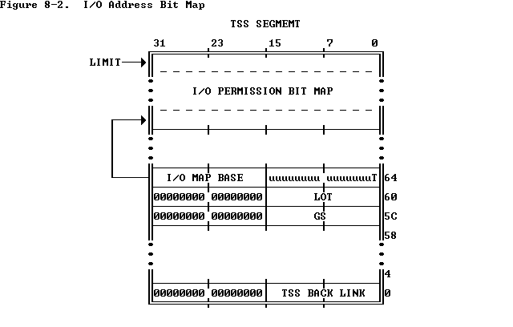

# JOS Lab 4

Operating System Engineering(Honor Track, 2019 Spring)

Jing Mai, 1700012751


## Part A: Multiprocessor Support and Cooperative Multitasking

> **Exercise 1.** Implement `mmio_map_region` in `kern/pmap.c`. To see how this is used, look at the beginning of `lapic_init` in `kern/lapic.c`. You'll have to do the next exercise, too, before the tests for `mmio_map_region` will run. 

In `kern/pmap.c`, just map the virtual address `[base, base+size)` to physical address `[pa,pa+size)`, and remember to check the boundary.

```c
void * mmio_map_region(physaddr_t pa, size_t size) {
	static uintptr_t base = MMIOBASE;
	uintptr_t upper;
	void *ret;
	upper = ROUNDUP(base + size, PGSIZE);
	if(upper > MMIOLIM)
		panic("mmio_map_region would overflow MMIOLIM");
	boot_map_region(kern_pgdir, base, upper - base, pa, PTE_PCD | PTE_PWT | PTE_W);
	ret = (void *) base;
	base = upper;
	return ret;
}
```

>  **Exercise 2.** Read `boot_aps()` and `mp_main()` in `kern/init.c`, and the assembly code in `kern/mpentry.S`. Make sure you understand the control flow transfer during the bootstrap of APs. Then modify your implementation of `page_init()` in `kern/pmap.c` to avoid adding the page at `MPENTRY_PADDR` to the free list, so that we can safely copy and run AP bootstrap code at that physical address. Your code should pass the updated `check_page_free_list()` test (but might fail the updated `check_kern_pgdir()` test, which we will fix soon). 

In `kern/pmap.c:page_init()`, avoid adding the physical page at `MPENTRY_PADDR` to the free list:

```c
void page_init(void) {
	size_t i;
	physaddr_t curupper = (physaddr_t)PADDR(boot_alloc(0));// next free page in physical memory

	page_free_list = NULL;

	for (i = 0; i < npages; i++) {
		physaddr_t ptr = i * PGSIZE; // the beginning physical address of page i

		pages[i].pp_ref = 0;
		
		if(ptr == MPENTRY_PADDR)	// the physical page at MPENTRY_PADDR is in use.
			continue;
		if((0 < i && i < npages_basemem)		// the rest of base memory is free.
			|| (ptr >= EXTPHYSMEM && ptr >= curupper)){			// free extended memory
			pages[i].pp_link = page_free_list;
			page_free_list = &pages[i];
		}
	}
}
```

> **Question**
>
> 1. Compare `kern/mpentry.S` side by side with `boot/boot.S`. Bearing in mind that `kern/mpentry.S` is compiled and linked to run above `KERNBASE` just like everything else in the kernel, what is the purpose of macro `MPBOOTPHYS`? Why is it necessary in `kern/mpentry.S` but not in `boot/boot.S`? In other words, what could go wrong if it were omitted in `kern/mpentry.S`? 
>    Hint: recall the differences between the link address and the load address that we have discussed in Lab 1.

1. To purpose of macro `MPBOOTPHYS` is to calculate actual addresses of its symbols when the code `kern/mpentry.S` is loaded at physical address `MPENTRY_PADDR`. Note that `kern/mpentry.S` is compiled and linked to run above `KERNBASE` just like everything else in the kernel(we can affirm it in `obj/kern/kernel.sym`). On the other hand, the symbols' addresses in `boot/boot.S` are at low addresses. 

   If it were omitted in `kern/mpentry.S`, notice that non-boot CPU ("AP") hasn't set up the the page translation mechanism yet, it will go wrong at the instruction `  lgdt  MPBOOTPHYS(gdtdesc)`.

>  **Exercise 3.** Modify `mem_init_mp()` (in `kern/pmap.c`) to map per-CPU stacks starting at `KSTACKTOP`, as shown in `inc/memlayout.h`. The size of each stack is `KSTKSIZE` bytes plus `KSTKGAP` bytes of unmapped guard pages. Your code should pass the new check in `check_kern_pgdir()`. 

```c
static void mem_init_mp(void)
{
	for(int i = 0; i < NCPU; i++){
		uintptr_t kstacktop_i = KSTACKTOP - i * (KSTKSIZE + KSTKGAP);
		boot_map_region(kern_pgdir, kstacktop_i - KSTKSIZE, KSTKSIZE, PADDR(percpu_kstacks[i]), PTE_W);
	}
}
```

>  **Exercise 4.** The code in `trap_init_percpu()` (`kern/trap.c`) initializes the TSS and TSS descriptor for the BSP. It worked in Lab 3, but is incorrect when running on other CPUs. Change the code so that it can work on all CPUs. (Note: your new code should not use the global `ts` variable any more.) 

`cpu_ts.ts_iomb` is the address of I/O permission bit map. When we use sensitive IO instructions, like `IN`, `OUT` and etc, the processor first checks whether `CPL <= IOPL`.  If this condition is true, the I/O operation may proceed. If not true, the processor checks the I/O permission map.  The I/O map base field is 16 bits wide and contains the offset of the beginning of the I/O permission map. thus `cpu_ts.ts_iomb `should not less than `sizeof(*struct* Taskstate)`.

  

Cited form  https://cs.nyu.edu/~mwalfish/classes/15fa/ref/i386/s08_03.htm.

```c
void trap_init_percpu(void){
	int i;

	i = cpunum();

	thiscpu->cpu_ts.ts_esp0 =  KSTACKTOP - i * (KSTKSIZE + KSTKGAP);
	thiscpu->cpu_ts.ts_ss0 = GD_KD;
	thiscpu->cpu_ts.ts_iomb = sizeof(struct Taskstate);

	// Initialize the TSS slot of the gdt.
	gdt[(GD_TSS0 >> 3) + i] = SEG16(STS_T32A, (uint32_t) (&thiscpu->cpu_ts),
					sizeof(struct Taskstate) - 1, 0);
	gdt[(GD_TSS0 >> 3) + i].sd_s = 0;

	// Load the TSS selector (like other segment selectors, the
	// bottom three bits are special; we leave them 0)
	ltr(GD_TSS0 + (i<<3));

	// Load the IDT
	lidt(&idt_pd);
}
```

>  **Exercise 5.** Apply the big kernel lock as described above, by calling `lock_kernel()` and `unlock_kernel()` at the proper locations. 

Just add `lock_kernel()` or `unlock_kernel()` as description. in `env_run()`, to avoid experiencing races or deadlocks, release big kernel lock after all the writing instruction  about shared objects between different processors.

```c
void env_run(struct Env *e){
	if(curenv && curenv->env_status == ENV_RUNNING)
		curenv->env_status = ENV_RUNNABLE;
	curenv = e;
	curenv->env_status = ENV_RUNNING;
	curenv->env_runs++;
	lcr3(PADDR(e->env_pgdir));
    unlock_kernel();
	env_pop_tf(&e->env_tf);	
}
```

> **Question**
>
> 2. It seems that using the big kernel lock guarantees that only one CPU can run the kernel code at a time. Why do we still need separate kernel stacks for each CPU? Describe a scenario in which using a shared kernel stack will go wrong, even with the protection of the big kernel lock.

A scenario is that when an exception/interrupt occurs, the hardware may automatically push `eflags`, `cs`, `eip` and etc.(see `inc/trap.h:struct Trapframe` for detail) into kernel stack without checking the big kernel lock, which is a behavior of software.

> **Exercise 6.** Implement round-robin scheduling in `sched_yield()` as described above. Don't forget to modify `syscall()` to dispatch `sys_yield()`.
>
> Make sure to invoke `sched_yield()` in `mp_main`.
>
> Modify `kern/init.c` to create three (or more!) environments that all run the program `user/yield.c`.
>
> Run `make qemu`. You should see the environments switch back and forth between each other five times before terminating, like below.
>
> Test also with several CPUS: `make qemu CPUS=2`.
>
> ```
> ...
> Hello, I am environment 00001000.
> Hello, I am environment 00001001.
> Hello, I am environment 00001002.
> Back in environment 00001000, iteration 0.
> Back in environment 00001001, iteration 0.
> Back in environment 00001002, iteration 0.
> Back in environment 00001000, iteration 1.
> Back in environment 00001001, iteration 1.
> Back in environment 00001002, iteration 1.
> ...
> ```
>
> After the `yield` programs exit, there will be no runnable environment in the system, the scheduler should invoke the JOS kernel monitor. If any of this does not happen, then fix your code before proceeding.

In `kern/sched.c`, implement the RR scheduling algorithm.

```c
void sched_yield(void)
{
	struct Env *idle;
	struct Env *env;
	int i;

	env = thiscpu->cpu_env;
	if(!env) env = envs + (NENV - 1);
	for(int i = 0; i < NENV; i++){
		env++;
		if(env == envs + NENV) env = envs;
		if(env->env_status == ENV_RUNNABLE)
			env_run(env);
	}
	if(thiscpu->cpu_env && thiscpu->cpu_env->env_status == ENV_RUNNING)
		env_run(thiscpu->cpu_env);

	// sched_halt never returns
	sched_halt();
}
```

Test with 2 CPUs, and the program acts as expected.

```bash
6828 decimal is 15254 octal!                                       
Physical memory: 131072K available, base = 640K, extended = 130432K
check_page_free_list() succeeded!                                  
check_page_alloc() succeeded!                                      
check_page() succeeded!                                            
check_kern_pgdir() succeeded!                                      
check_page_free_list() succeeded!                                  
check_page_installed_pgdir() succeeded!                            
SMP: CPU 0 found 2 CPU(s)                                          
enabled interrupts: 1 2                                            
SMP: CPU 1 starting                                                
[00000000] new env 00001000                                        
[00000000] new env 00001001                                        
[00000000] new env 00001002                                        
Hello, I am environment 00001000.                                  
Hello, I am environment 00001001.                                  
Hello, I am environment 00001002.                                  
Back in environment 00001000, iteration 0.                         
Back in environment 00001001, iteration 0.                         
Back in environment 00001002, iteration 0.                         
Back in environment 00001000, iteration 1.                         
Back in environment 00001001, iteration 1.                         
Back in environment 00001002, iteration 1.                         
Back in environment 00001000, iteration 2.                         
Back in environment 00001001, iteration 2.                         
Back in environment 00001002, iteration 2.                         
Back in environment 00001001, iteration 3.                         
Back in environment 00001000, iteration 3.                         
Back in environment 00001002, iteration 3.                         
Back in environment 00001001, iteration 4.                         
Back in environment 00001000, iteration 4.                         
All done in environment 00001001.                                  
All done in environment 00001000.                                  
[00001001] exiting gracefully                                      
[00001001] free env 00001001                                       
[00001000] exiting gracefully                                      
[00001000] free env 00001000                                       
Back in environment 00001002, iteration 4.                         
All done in environment 00001002.                                  
[00001002] exiting gracefully                                      
[00001002] free env 00001002                                       
No runnable environments in the system!                            
Welcome to the JOS kernel monitor!                                 
Type 'help' for a list of commands.                                                              K>                                                                
```

> **Question**
>
> 3. In your implementation of `env_run()` you should have called `lcr3()`. Before and after the call to `lcr3()`, your code makes references (at least it should) to the variable `e`, the argument to `env_run`. Upon loading the `%cr3` register, the addressing context used by the MMU is instantly changed. But a virtual address (namely `e`) has meaning relative to a given address context--the address context specifies the physical address to which the virtual address maps. Why can the pointer `e` be dereferenced both before and after the addressing switch?
> 4. Whenever the kernel switches from one environment to another, it must ensure the old environment's registers are saved so they can be restored properly later. Why? Where does this happen?

3. Notice that the virtual address pointed by `e` is located above `KERNBASE`, which is in the kernel space, thus the page tables used before and after `lcr3()` both translate this virtual address to the identical physical address.

   ```bash
   (gdb) b kern/env.c:575
   Breakpoint 1 at 0xf0103b64: file kern/env.c, line 575.
   (gdb) c
   Continuing.
   The target architecture is assumed to be i386
   => 0xf0103b64 <env_run+103>:    call   0xf01058bf <cpunum>
   
   Breakpoint 1, env_run (e=0xf02b0000) at kern/env.c:575
   575             curenv->env_runs++;
   (gdb) b kern/env.c:577
   Breakpoint 2 at 0xf0103bac: file kern/env.c, line 577.
   (gdb) p cpunum()
   $1 = 0
   (gdb) disp e
   1: e = (struct Env *) 0xf02b0000
   (gdb) c
   Continuing.
   => 0xf0103bac <env_run+175>:    mov    %ebx,(%esp)
   
   Breakpoint 2, env_run (e=0xf02b0000) at kern/env.c:578
   578             env_pop_tf(&e->env_tf);
   1: e = (struct Env *) 0xf02b0000
   ```
   
4. The purpose of saving and restoring the old environment context is to implement the context switching and multiprogramming technology, which could run program concurrently. 

   The context switching is achieved by the exception/interrupt mechanism. The storage of environment context takes places when an exception/interrupt happens.

   1. The `ss` and `esp` of the current CPU's kernel stack is stored at TSS segment(see `kern/trap.c:trap_init_percpu`),and the TSS selector is loaded into  task register by `ltr()`.
   2. When an exception/interrupt occurs, the processor firstly finds the location of the kernel stack(i.e., kernel stack's `ss` and `esp`) of current CPU by accessing the TSS segment, and then push the old registers `ss`, `esp`, `eflags`, `cs`, `eip`  and error code onto kernel stack by hardware.
   3. Then the processor push the exception/interrupt number, `ds`, `es` and all the general registers into kernel stack by software.(in `kern/trapentry.S`).
   4. If we the switch from user-mode to kernel mode, we also need to copy trap frame (which is currently on the kernel stack) into the environment array `envs[]` , so that running the environment, will restart at the trap point.
   
   By this routine, the environment context is stored in the environment array.
   
   On the other hand, he recovery of context switching happens in `kern/env.c:env_run` and `kern/env.c:env_pop_tf`, which restores the general registers, `es`, `ds` by software instruction, and `eip`, `cs`, `eflags`, `esp`, `ss` by `iret`.
   
   

> ​    **Exercise 7.** Implement the system calls described above in `kern/syscall.c` and make sure `syscall()` calls them. You will need to use various functions in `kern/pmap.c` and `kern/env.c`, particularly `envid2env()`. For now, whenever you call `envid2env()`, pass 1 in the `checkperm` parameter. Be sure you check for any invalid system call arguments, returning `-E_INVAL` in that case. Test your JOS kernel with `user/dumbfork` and make sure it works before proceeding. 

Follow the guide in `kern/syscall.c` and fill in the function ` sys_exofork `, ` sys_env_set_status `, `sys_page_alloc`, `sys_page_map` and `sys_page_unmap`. And then add their dispatchers in `kern/syscall.c:syscall`. 

One tricky thing in `sys_exofork` is that how we achieve the the goal that the parent process and the child process get different return value of `sys_exofork`. Notice that it is the register`%eax` that holds the return value.in `syscall.c:syscall`:

```c
static inline int32_t
syscall(int num, int check, uint32_t a1, uint32_t a2, uint32_t a3, uint32_t a4, uint32_t a5)
{
	int32_t ret;
    
	asm volatile("int %1\n"
		     : "=a" (ret)
		     : "i" (T_SYSCALL),
		       "a" (num),
		       "d" (a1),
		       "c" (a2),
		       "b" (a3),
		       "D" (a4),
		       "S" (a5)
		     : "cc", "memory");

	if(check && ret > 0)
		panic("syscall %d returned %d (> 0)", num, ret);

	return ret;
}
```

So we modify the stored `%eax` value in the trap frame of new environment. By this mean, the modified return value will be returned in child environment as mention above.

in `kern/syscall.c`:

```c
static envid_t sys_exofork(void){
	envid_t rc = 0, parent_id;
	struct Env *child_env;

	assert(curenv);
	parent_id = curenv->env_id;
	if((rc = env_alloc(&child_env, parent_id)) < 0)
		return rc;
	child_env->env_status = ENV_NOT_RUNNABLE;
	child_env->env_tf = curenv->env_tf;
	child_env->env_tf.tf_regs.reg_eax = 0; // tweaked so sys_exofork will return 0 for child process
	return child_env->env_id;
}
```

## Part B: Copy-on-Write Fork

>  **Exercise 8.** Implement the `sys_env_set_pgfault_upcall` system call. Be sure to enable permission checking when looking up the environment ID of the target environment, since this is a "dangerous" system call. 

In `kern/sys/`

>  **Exercise 9.** Implement the code in `page_fault_handler` in `kern/trap.c` required to dispatch page faults to the user-mode handler. Be sure to take appropriate precautions when writing into the exception stack. (What happens if the user environment runs out of space on the exception stack?) 


>  **Exercise 10.** Implement the `_pgfault_upcall` routine in `lib/pfentry.S`. The interesting part is returning to the original point in the user code that caused the page fault. You'll return directly there, without going back through the kernel. The hard part is simultaneously switching stacks and re-loading the EIP. 


>  **Exercise 11.** Finish `set_pgfault_handler()` in `lib/pgfault.c`. 


> **Exercise 12.** Implement `fork`, `duppage` and `pgfault` in `lib/fork.c`.
>
> Test your code with the `forktree` program. It should produce the following messages, with interspersed 'new env', 'free env', and 'exiting gracefully' messages. The messages may not appear in this order, and the environment IDs may be different.
>
> ```
> 	1000: I am ''
> 	1001: I am '0'
> 	2000: I am '00'
> 	2001: I am '000'
> 	1002: I am '1'
> 	3000: I am '11'
> 	3001: I am '10'
> 	4000: I am '100'
> 	1003: I am '01'
> 	5000: I am '010'
> 	4001: I am '011'
> 	2002: I am '110'
> 	1004: I am '001'
> 	1005: I am '111'
> 	1006: I am '101'
> ```

## Part C: Preemptive Multitasking and Inter-Process communication (IPC)

> **Exercise 13.** Modify `kern/trapentry.S` and `kern/trap.c` to initialize the appropriate entries in the IDT and provide handlers for IRQs 0 through 15. Then modify the code in `env_alloc()` in `kern/env.c` to ensure that user environments are always run with interrupts enabled.
>
> Also uncomment the `sti` instruction in `sched_halt()` so that idle CPUs unmask interrupts.
>
> The processor never pushes an error code when invoking a hardware interrupt handler. You might want to re-read section 9.2 of the [80386 Reference Manual](https://pdos.csail.mit.edu/6.828/2018/readings/i386/toc.htm), or section 5.8 of the[IA-32 Intel Architecture Software Developer's Manual, Volume 3](https://pdos.csail.mit.edu/6.828/2018/readings/ia32/IA32-3A.pdf), at this time.
>
> After doing this exercise, if you run your kernel with any test program that runs for a non-trivial length of time (e.g., `spin`), you should see the kernel print trap frames for hardware interrupts. While interrupts are now enabled in the processor, JOS isn't yet handling them, so you should see it misattribute each interrupt to the currently running user environment and destroy it. Eventually it should run out of environments to destroy and drop into the monitor.


> **Exercise 14.** Modify the kernel's `trap_dispatch()` function so that it calls `sched_yield()` to find and run a different environment whenever a clock interrupt takes place.
>
> You should now be able to get the `user/spin` test to work: the parent environment should fork off the child, `sys_yield()` to it a couple times but in each case regain control of the CPU after one time slice, and finally kill the child environment and terminate gracefully.


> **Exercise 15.** Implement `sys_ipc_recv` and `sys_ipc_try_send` in `kern/syscall.c`. Read the comments on both before implementing them, since they have to work together. When you call `envid2env` in these routines, you should set the `checkperm` flag to 0, meaning that any environment is allowed to send IPC messages to any other environment, and the kernel does no special permission checking other than verifying that the target envid is valid.
>
> Then implement the `ipc_recv` and `ipc_send` functions in `lib/ipc.c`.
>
> Use the `user/pingpong` and `user/primes` functions to test your IPC mechanism. `user/primes` will generate for each prime number a new environment until JOS runs out of environments. You might find it interesting to read `user/primes.c` to see all the forking and IPC going on behind the scenes.

