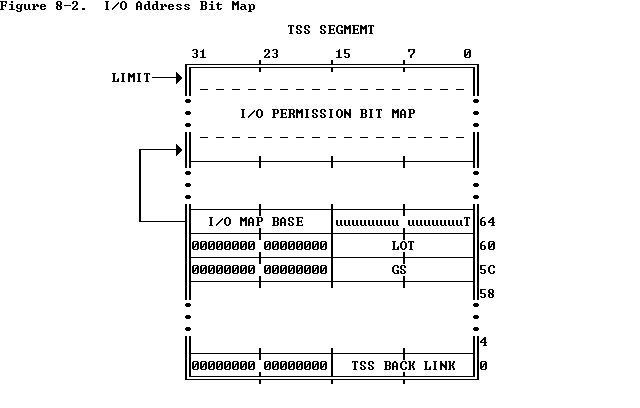

# JOS Lab 5

Operating System Engineering(Honor Track, 2019 Spring)

Jing Mai, 1700012751

## The File System

### Disk Access

> **Exercise 1.** `i386_init` identifies the file system environment by passing the type `ENV_TYPE_FS` to your environment creation function, `env_create`. Modify `env_create` in `env.c`, so that it gives the file system environment I/O privilege, but never gives that privilege to any other environment.
>
> Make sure you can start the file environment without causing a General Protection fault. You should pass the "fs i/o" test in make grade.

In `kern/env.c`, we assigns `IOPL` to 3, so that the file system user-environment, whose `CPL` equals to 3, could use sensitive IO instructions.

```c
void env_create(uint8_t *binary, enum EnvType type){
	......
	// If this is the file server (type == ENV_TYPE_FS) give it I/O privileges.
	// LAB 5: Your code here.
	if(type == ENV_TYPE_FS)
		env->env_tf.tf_eflags |= FL_IOPL_3;
}
```

> What is the process of IO privilege checking?

 When we use sensitive IO instructions, like `IN`, `OUT` and etc, the processor first checks whether `CPL <= IOPL`.  If this condition is true, the I/O operation may proceed. If not true, the processor checks the I/O permission map in TSS.  The I/O map base field is 16 bits wide and contains the offset of the beginning of the I/O permission map. 

   

Cited form  https://cs.nyu.edu/~mwalfish/classes/15fa/ref/i386/s08_03.htm.

> **Question**
>
> 1. Do you have to do anything else to ensure that this I/O privilege setting is saved and restored properly when you subsequently switch from one environment to another? Why?

No. As the IO privilege `IOPL` is stored in `eflags` and could be saved and restored along with `eflags`.

### The Block Cache

> **Exercise 2.** Implement the `bc_pgfault` and `flush_block` functions in `fs/bc.c`. `bc_pgfault` is a page fault handler, just like the one your wrote in the previous lab for copy-on-write fork, except that its job is to load pages in from the disk in response to a page fault. When writing this, keep in mind that (1) `addr` may not be aligned to a block boundary and (2) `ide_read` operates in sectors, not blocks.
>
> The `flush_block` function should write a block out to disk *if necessary*. `flush_block` shouldn't do anything if the block isn't even in the block cache (that is, the page isn't mapped) or if it's not dirty. We will use the VM hardware to keep track of whether a disk block has been modified since it was last read from or written to disk. To see whether a block needs writing, we can just look to see if the `PTE_D` "dirty" bit is set in the `uvpt` entry. (The `PTE_D` bit is set by the processor in response to a write to that page; see 5.2.4.3 in [chapter 5](http://pdos.csail.mit.edu/6.828/2011/readings/i386/s05_02.htm) of the 386 reference manual.) After writing the block to disk, `flush_block` should clear the `PTE_D` bit using `sys_page_map`.
>
> Use make grade to test your code. Your code should pass "check_bc", "check_super", and "check_bitmap".

In `fs/bc.c:bg_fault`, we can remap the disk address into the the file system’s virtual address space by the means of page fault handler. In page fault handler, firstly we have to allocate a page in the virtual address space of the file system environment, and then we could use IO instructions and copy the data from disk.

```c
static void
bc_pgfault(struct UTrapframe *utf){
	......
	// Allocate a page in the disk map region, read the contents
	// of the block from the disk into that page.
	// Hint: first round addr to page boundary. fs/ide.c has code to read
	// the disk.
	//
	// LAB 5: you code here:
	void* page_addr = ROUNDDOWN(addr, PGSIZE);
	if((r = sys_page_alloc(0, page_addr, PTE_SYSCALL)) < 0)
		panic("in bg_fault, sys_page_alloc: %e", r);
	
	uint32_t secno = blockno * (BLKSIZE / SECTSIZE);
	size_t nsecs = PGSIZE / SECTSIZE;
	if((r = ide_read(secno, page_addr, nsecs)<0))
		panic("in bc_pgfault, ide_read: %e", r);
	......
}
```

In `fs/bc.c:flush_block`, use IO instructions to write a block out to disk if necessary.


```c
void
flush_block(void *addr)
{
	uint32_t blockno = ((uint32_t)addr - DISKMAP) / BLKSIZE;
	int r;
	if (addr < (void*)DISKMAP || addr >= (void*)(DISKMAP + DISKSIZE))
		panic("flush_block of bad va %08x", addr);

	// LAB 5: Your code here.

	void *page_addr = ROUNDDOWN(addr, PGSIZE);
	uint32_t secno = blockno * (BLKSIZE / SECTSIZE);
	size_t nsecs = PGSIZE / SECTSIZE;

	if(!va_is_mapped(page_addr) || !va_is_dirty(page_addr)){
		/* If the block is not in the block cache or is not dirty, does nothing. */
		return;
	}
	if((r = ide_write(secno, page_addr, nsecs)) < 0)
		panic("in flush_bloc, ide_write: %e", r);
	
	if((r = sys_page_map(0, page_addr, 0, page_addr, uvpt[PGNUM(page_addr)] & PTE_SYSCALL)) < 0)
		panic("in flush_block, sys_page_map: %e", r);
}
```

### The Block Bitmap

> **Exercise 3.** Use `free_block` as a model to implement `alloc_block` in `fs/fs.c`, which should find a free disk block in the bitmap, mark it used, and return the number of that block. When you allocate a block, you should immediately flush the changed bitmap block to disk with `flush_block`, to help file system consistency.
>
> Use make grade to test your code. Your code should now pass "alloc_block".

Use a simple linear for loop to find a free block. Note that the root(0) block, reserved block(1) and blocks for bitmaps should not be allocated.


````c
int
alloc_block(void)
{
	// The bitmap consists of one or more blocks.  A single bitmap block
	// contains the in-use bits for BLKBITSIZE blocks.  There are
	// super->s_nblocks blocks in the disk altogether.

	// LAB 5: Your code here.

	/* the root(0) block, reserved block(1) and blocks for bitmaps should not be allocated. */
	uint32_t blockno = 2 + super->s_nblocks / BLKBITSIZE;

	for(; blockno < super->s_nblocks; blockno++)
		if(block_is_free(blockno)){
			/* find a free block*/

			/* allocate this block */
			bitmap[blockno/32] ^= 1<<(blockno%32);

			/* flush the changed bitmap block to disk with flush_block. */			
			flush_block(&bitmap[blockno/32]);

			return blockno;
		}
	return -E_NO_DISK;
}
````

### File Operations

> **Exercise 4.** Implement `file_block_walk` and `file_get_block`. `file_block_walk` maps from a block offset within a file to the pointer for that block in the `struct File` or the indirect block, very much like what `pgdir_walk` did for page tables. `file_get_block` goes one step further and maps to the actual disk block, allocating a new one if necessary.
>
> Use make grade to test your code. Your code should pass "file_open", "file_get_block", and "file_flush/file_truncated/file rewrite", and "testfile".

the attribute `f_direct[]` and `f_indirect` store the block number, and we have to access to the disk content mapped into disk address space by `diskaddr` defined in `fs/bc.c`:

```c
static int
file_block_walk(struct File *f, uint32_t filebno, uint32_t **ppdiskbno, bool alloc){
	// LAB 5: Your code here.

	int r;

	if(filebno > NDIRECT + NINDIRECT){
		/* if filebno is out of range(it's >= NDIRECT + NINDIRECT), return -E_INVAL. */
		return -E_INVAL;
	}

	if(filebno < NDIRECT){
		*ppdiskbno = &f->f_direct[filebno];
		return 0;
	}
	
	if(f->f_indirect == 0){
		if(alloc == 0){
			/* if the function needed to allocate an indirect block, but alloc was 0, return -E_NOT_FOUND. */
			return -E_NOT_FOUND;
		}
		if((r = alloc_block()) < 0){
			/* if there's no space on the disk for an indirect block, return -E_NO_DISK. */
			return r;
		}
		f->f_indirect = r;
		/* clear any block you allocate. */
		memset(diskaddr(r), 0, BLKSIZE);
	}

	uint32_t *indirect_addr = diskaddr(f->f_indirect);
	*ppdiskbno = &indirect_addr[filebno - NDIRECT];

	return 0;
}
```

```c
int
file_get_block(struct File *f, uint32_t filebno, char **blk){
	// LAB 5: Your code here.
    int r;
	uint32_t *ppdiskbno;

	if((r = file_block_walk(f, filebno, &ppdiskbno, true) < 0))
		return r;
	
	if(*ppdiskbno == 0){
		if((r = alloc_block()) < 0)
			return r;
		*ppdiskbno = r;
		memset(diskaddr(r), 0, BLKSIZE);
	}
	*blk =diskaddr(*ppdiskbno);
	return 0;
}
```

### The file system interface

> **Exercise 5.** Implement `serve_read` in `fs/serv.c`.
>
> `serve_read`'s heavy lifting will be done by the already-implemented `file_read` in `fs/fs.c` (which, in turn, is just a bunch of calls to `file_get_block`). `serve_read` just has to provide the RPC interface for file reading. Look at the comments and code in `serve_set_size` to get a general idea of how the server functions should be structured.
>
> Use make grade to test your code. Your code should pass "serve_open/file_stat/file_close" and "file_read" for a score of 70/150.

Note that `struct OpenFile` links `struct File` and `struct Fd`, thus we firstly use `openfile_lookup` to translate file IDs to `struct OpenFile`. The offset value is stored in `struct Fd` which sort of corresponds to a Unix file descriptor.  This `struct Fd` is kept on *its own page* in memory, and it is shared with any environments that have the file open. In `fs/serv.c:serve.read`:

```c
int
serve_read(envid_t envid, union Fsipc *ipc){
	int r;
	struct OpenFile *o;
	struct Fsreq_read *req = &ipc->read;
	struct Fsret_read *ret = &ipc->readRet;

	if (debug)
		cprintf("serve_read %08x %08x %08x\n", envid, req->req_fileid, req->req_n);

	// Lab 5: Your code here:
	if((r = openfile_lookup(envid, req->req_fileid, &o))<0)
		return r;

	if((r = file_read(o->o_file, ret->ret_buf, req->req_n, o->o_fd->fd_offset))>=0)
		o->o_fd->fd_offset += r;

	return r;
}
```

> **Exercise 6.** Implement `serve_write` in `fs/serv.c` and `devfile_write` in `lib/file.c`.
>
> Use make grade to test your code. Your code should pass "file_write", "file_read after file_write", "open", and "large file" for a score of 90/150.

Look at the code in `serve_read` and we can get a general idea of how `serve_write` should function.

```c
int
serve_write(envid_t envid, struct Fsreq_write *req)
{
	int r;
	struct OpenFile *o;

	if (debug)
		cprintf("serve_write %08x %08x %08x\n", envid, req->req_fileid, req->req_n);

	// LAB 5: Your code here.
	if((r = openfile_lookup(envid, req->req_fileid, &o))<0)
		return r;
	if((r = file_write(o->o_file, req->req_buf, req->req_n, o->o_fd->fd_offset))>=0)
		o->o_fd->fd_offset += r;
	return r;
}
```

`union Fsipc fsipcbuf`, which is mapped to the page `[0x0ffff000, 0x10000000) ` and shared between clients and server, could be viewed as the definition of file system IPC communication format. As we use IPC could only transmit a single 32-bit number and, optionally, share a page, thus we could only transmit at most one page at one time.

```c
static ssize_t
devfile_write(struct Fd *fd, const void *buf, size_t n)
{
	// Make an FSREQ_WRITE request to the file system server.  Be
	// careful: fsipcbuf.write.req_buf is only so large, but
	// remember that write is always allowed to write *fewer*
	// bytes than requested.
	// LAB 5: Your code here
	int r;
	assert(n <= sizeof(fsipcbuf.write.req_buf));
	fsipcbuf.write.req_fileid = fd->fd_file.id;
	fsipcbuf.write.req_n = n;
	memmove(fsipcbuf.write.req_buf, buf, n);
	return fsipc(FSREQ_WRITE, NULL);
}
```

## Spawning Processes

> **Exercise 7.** `spawn` relies on the new syscall `sys_env_set_trapframe` to initialize the state of the newly created environment. Implement `sys_env_set_trapframe` in `kern/syscall.c`(don't forget to dispatch the new system call in `syscall()`).
>
> Test your code by running the `user/spawnhello` program from `kern/init.c`, which will attempt to spawn `/hello` from the file system.
>
> Use make grade to test your code.

use `user_mem_assert` to check whether the user has supplied us with a good address. In order to make sure that user environments always run at code protection level 3 (CPL 3), we can assigns `env_tf.tf_cs` to `GD_UT | 3`. `GD_UT` is the user text segment selector (see `inc/memlayout.h`). The low 2 bits of segment register contains the Requestor Privilege Level (RPL), and 3 means user mode.

```c
static int
sys_env_set_trapframe(envid_t envid, struct Trapframe *tf)
{
	// LAB 5: Your code here.
	// Remember to check whether the user has supplied us with a good
	// address!
	int r;
	struct Env *env;

	if((r = envid2env(envid, &env, true)) < 0)
		return r;
	
	user_mem_assert(env, tf, sizeof(struct Trapframe), 0);

	env->env_tf = *tf;
    env->env_tf.tf_cs = GD_UT | 3;
	env->env_tf.tf_eflags &= ~((uint32_t)FL_IOPL_MASK);
	env->env_tf.tf_eflags |= FL_IF;
	return 0;
}
```

>  *Challenge!* Implement Unix-style `exec`. 

 Implementing a UNIX-style `exec` from user space in *exokernel fashion* is not such easy, as we need to replace even the code segment we are are running. So I decide to achieve it under the help of system call.

Firstly, we load the raw ELF files into a temporary region located at `EXECTEMP = 0xe0000000`(in `lib/exec.c`):

```c
int
exec(const char *prog, const char **argv){
    int r, fd;
    struct Stat st;
    
    /* read the state information of this elf file */
    if((r = stat(prog, &st)) < 0)
        return r;

    if((fd = open(prog, O_RDONLY)) < 0)
        return fd;
    
    void *va = (void *)EXECTEMP;
    void *end = (void*)(EXECTEMP + st.st_size);

    /* read the raw ELF file at EXECTEMP in memory */
    do{
        if((r = sys_page_alloc(0, va, PTE_U | PTE_P | PTE_W)) < 0)
            goto error;
        size_t n = MIN(PGSIZE, end - va);
        if((r = readn(fd, va, n)) < 0)
            goto error;
        va += n;
    }while(va < end);

    if((r = sys_exec((uint8_t*)EXECTEMP, argv))<0) /* If on success, it will never return. */
        goto error;
    
error:
    close(fd);
    return r;
}
```

That we use system call `sys_exec` to make sure that the code body of this function is located above `USTACKTOP`. Consulting the implement of `kern/env.c:load_icode`, we set up program segments and code entry as defined in ELF header.(in `kern/syscall.c:sys_exec`)

```c
static int
sys_exec(uint8_t *binary, const char **argv){
	int r;
	struct Proghdr *ph, *eph;
	struct Elf *elf = (struct Elf *)binary;
	uintptr_t va;
	size_t memsz, filesz, offset;

	if(elf->e_magic != ELF_MAGIC)
		panic("sys_exec: bad elf");
	
	ph = (struct Proghdr *) (binary + elf->e_phoff);
	eph = ph + elf->e_phnum;
	
	/* 
	* Set up program segments as defined in ELF header.
	* consult the implementation of kern/env.c:load_icode.
	*/
	for(;ph < eph; ph++){
		if(ph->p_type == ELF_PROG_LOAD){
			va = ph->p_va;
			memsz = ph->p_memsz;
			filesz = ph->p_filesz;
			offset = ph->p_offset;
			if(filesz > memsz)
				panic("segment file size is larger than segment memory size");
			region_alloc(curenv, (void*)va, memsz);
			memmove((void*)va, binary + offset, filesz);
            memset((void*)(va+filesz), 0, memsz - filesz);
		}
	}
    
    /* set up the initial $eip. */
	curenv->env_tf.tf_eip = elf->e_entry;
```

We also need to initialize the user normal stack like what we have done in `spawn` under the transition through `UTEMP`.

```c
	/* initialize the stack*/
	if((r = init_stack(argv, &curenv->env_tf.tf_esp))<0)
		panic("sys_exec: init_stack: %e", r);
	
	sched_yield(); // never return.
}
```

Finally, we also provide two program `user/exececho.c` and `user/exechello.c` to test our implement, feel free to run `make run-exechello-nox` or `make run-exechello`.

```c
// exechello.c
#include <inc/lib.h>

void
umain(int argc, char **argv){
    int r;
	cprintf("hello, world\n");
	cprintf("i am environment %08x\n", thisenv->env_id);
    char paras[4][356]={
        "exececho",
        "hello",
        "I am executed from exec!"
    }; // make sure that these strings are stored on stack.
    for(int i = 0; i < 3; i++)
        cprintf("address of para[%d]: %p\n", i, paras[i]);
    if((r =  execl("exececho", paras[0], paras[1], paras[2], 0)) < 0) // never return
        panic("exec never return!: %e", r);
}
```

```c
// exececho.c
#include <inc/lib.h>

void
umain(int argc, char **argv){
    cprintf("i am environment %08x from exececho\n", thisenv->env_id);
    for(int i = 0; i < argc; i++)
        cprintf("argv[%d]=%s\n", i, argv[i]);
}
```

### Sharing library state across fork and spawn

> **Exercise 8.** Change `duppage` in `lib/fork.c` to follow the new convention. If the page table entry has the `PTE_SHARE` bit set, just copy the mapping directly. (You should use `PTE_SYSCALL`, not `0xfff`, to mask out the relevant bits from the page table entry. `0xfff` picks up the accessed and dirty bits as well.)
>
> Likewise, implement `copy_shared_pages` in `lib/spawn.c`. It should loop through all page table entries in the current process (just like `fork` did), copying any page mappings that have the `PTE_SHARE` bit set into the child process.

in `lib/fork.c:duppage`, if the page table entry has the `PTE_SHARE` bit set, just copy the mapping directly, in which way the parent and the child could share the same page.

One potential bug is that in following code, the condition branch `if(pte & PTE_SHARE)` should be placed before `if((pte & PTE_W) || (pte & PTE_COW))`, as `PTE_SHARE` and `PTE_W` could coexist in one page table entry.

```c
static int
duppage(envid_t envid, unsigned pn){
	int r;
	pte_t pte;
	void *addr  = (void*)(pn << PGSHIFT);

	// LAB 4: Your code here.
	pte = uvpt[pn];
	if(pte & PTE_SHARE){
		if((r = sys_page_map(0, addr, envid, addr, PTE_SYSCALL))<0)
			return r;
	}
	else if((pte & PTE_W) || (pte & PTE_COW)){
		if((r = sys_page_map(0, addr, envid, addr, PTE_U | PTE_P | PTE_COW))<0)
			return r;
		if((r = sys_page_map(0, addr, 0, addr, PTE_U | PTE_P | PTE_COW))<0)
			return r;
	}else{
		if((r = sys_page_map(0, addr, envid, addr, PTE_U | PTE_P))<0)
			return r;
	}
	return 0;
}
```

in `lib/spawn.c`, just refer to the code in `lib/fork.c`.

```c
static int
copy_shared_pages(envid_t child)
{
	// LAB 5: Your code here.
	int r, pdi, pti, pn;
	void *addr;

	for(pdi = 0; pdi < PDX(UTOP); pdi++){
		if(!(uvpd[pdi] & PTE_P))
			continue;
		for(pti = 0; pti < NPDENTRIES; pti++){
			pn = (pdi << 10) + pti;
			if((uvpt[pn] & PTE_P) && (uvpt[pn] & PTE_SHARE)){
				addr = (void*)(pn << PGSHIFT);
				if((r = sys_page_map(0, addr, child, addr, PTE_SYSCALL & uvpt[pn]))<0)
					panic("in lib/spawn.c:copy_shared_pages: %e", r);			
			}
		}
	}
	return 0;
}
```

> What is the different between `fork`, `exec` and `spawn` in JOS?

- `fork`: child environment and parent environment are totally the same when the former is created, consisting of the file descriptor table. However, they are independent after the child is created.
- `exec`: Just a mean to load a ELF file, rewrite the whole virtual address space. Note that `exec` never allocate a new environment.
- `spawn`: similar to `exec`, but `spawn` allocate a new environment and the pages with `PTE_SHARE` in their page table entries could be shared between parent and child.  The `spawn` function effectively acts like a `fork` in UNIX followed by an immediate `exec` in the child process. 

### The keyboard interface

>  **Exercise 9.** In your `kern/trap.c`, call `kbd_intr` to handle trap `IRQ_OFFSET+IRQ_KBD` and `serial_intr` to handle trap `IRQ_OFFSET+IRQ_SERIAL`. 

Dispatch trap number `IRQ_OFFSET+IRQ_KBD` and `IRQ_OFFSET+IRQ_SERIAL` in `kern/trap.c:trap_dispatch`:

```c
	// Handle keyboard and serial interrupts.
	// LAB 5: Your code here.
	if(tf->tf_trapno == IRQ_OFFSET+IRQ_KBD){
		kbd_intr();
		return;
	}

	if(tf->tf_trapno == IRQ_OFFSET+IRQ_SERIAL){
		serial_intr();
		return;
	}
```

## The Shell

> **Exercise 10.**
>
> The shell doesn't support I/O redirection. It would be nice to run sh <script instead of having to type in all the commands in the script by hand, as you did above. Add I/O redirection for < to `user/sh.c`.
>
> Test your implementation by typing sh <script into your shell
>
> Run make run-testshell to test your shell. `testshell` simply feeds the above commands (also found in `fs/testshell.sh`) into the shell and then checks that the output matches `fs/testshell.key`.

in `user/sh.c`, implement case branch `case '<'` as `case '>'` below.

```c
case '<':	// Input redirection
			// Grab the filename from the argument list
			if (gettoken(0, &t) != 'w') {
				cprintf("syntax error: < not followed by word\n");
				exit();
			}
			// Open 't' for reading as file descriptor 0
			// (which environments use as standard input).
			// We can't open a file onto a particular descriptor,
			// so open the file as 'fd',
			// then check whether 'fd' is 0.
			// If not, dup 'fd' onto file descriptor 0,
			// then close the original 'fd'.

			// LAB 5: Your code here.
			if((fd = open(t, O_RDONLY))<0){
				cprintf("open %s for read: %e", t, fd);
				exit();
			}
			if(fd != 0){
				dup(fd, 0);
				close(fd);
			}
			break;
```

Finally, we pass all tests and finish one challenge.

```bash
internal FS tests [fs/test.c]: OK (2.8s) 
  fs i/o: OK 
  check_bc: OK 
  check_super: OK 
  check_bitmap: OK 
  alloc_block: OK 
  file_open: OK 
  file_get_block: OK 
  file_flush/file_truncate/file rewrite: OK 
testfile: OK (2.3s) 
  serve_open/file_stat/file_close: OK 
  file_read: OK 
  file_write: OK 
  file_read after file_write: OK 
  open: OK 
  large file: OK 
spawn via spawnhello: OK (1.7s) 
Protection I/O space: OK (1.7s) 
PTE_SHARE [testpteshare]: OK (1.7s) 
PTE_SHARE [testfdsharing]: OK (1.9s) 
start the shell [icode]: Timeout! OK (31.6s) 
testshell: OK (3.2s) 
    (Old jos.out.testshell failure log removed)
primespipe: OK (6.9s) 
Score: 150/150
```

